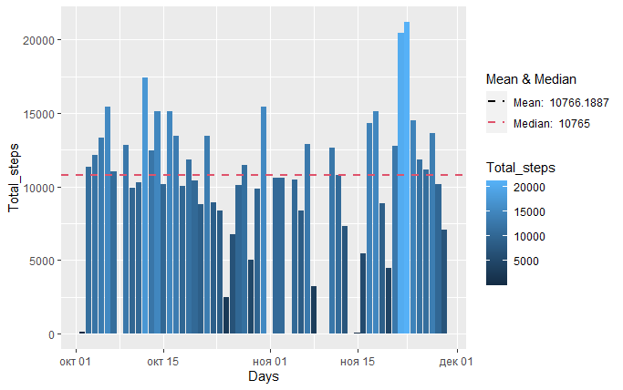
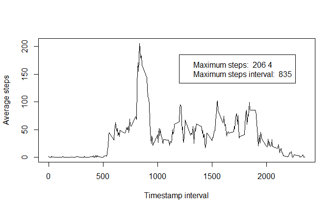
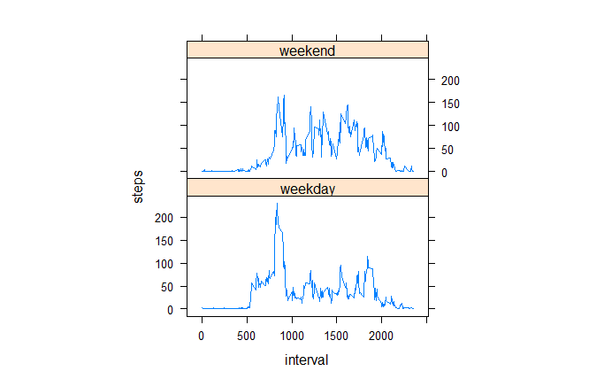

## Loading libraries

The first step is to load all the necessary libraries to run the code

```{r Loading libraries, eval=FALSE, message=TRUE, warning=FALSE,}
library(dplyr)
library(stringr)
library(reshape2)
library(chron)
library(data.table)
library(ggplot2)
library(grid)
library(gridExtra)
library(lattice)
library()
```

## Loading and preprocessing the data
The next step is to load and process the data. For this purposes, we first download the file and save it to the working directory:

```{r Download file, tidy=TRUE, tidy.opts=list(width.cutoff=60), eval=FALSE, message=FALSE, warning=FALSE}
dirPath <- getwd()
download.file('https://d396qusza40orc.cloudfront.net/repdata%2Fdata%2Factivity.zip', 
              destfile = paste(dirPath,'/activity.zip', sep = ''))
```

Second, we unzip the file to the same working directory and read it to a data table:

```{r Unzip and read CSV, eval=FALSE, message=FALSE, warning=FALSE}
unzip(zipfile = 'activity.zip', exdir = getwd())
activity_dt <- read.table(file = 'activity.csv', header = TRUE, sep = ',')
```

And finally, before starting to plot and answer the assignment questions, we need to do some data preparations - validate Data formats and make a data table with NAs removed:

```{undefinedData transformations, eval=FALSE, message=FALSE, warning=FALSE}
activity_dt$date <- as.Date(activity_dt$date, origin = '2012-10-01')
activity_dt_NM <- na.omit(activity_dt)
```

## What is mean total number of steps taken per day?
To answer this question, we need to do some calculations first.

1. Calculating steps by day:

```{undefinedSteps by day calculations, eval=FALSE, message=FALSE, warning=FALSE}
steps_ByDay <- aggregate(activity_dt$steps, by = list(activity_dt$date), sum)
colnames(steps_ByDay) <- c('Days', 'Total_steps')
```
2. Calculating the mean and the median:

```{r Mean & median calculations, eval=FALSE, message=FALSE, warning=FALSE}
steps_mean <- round(mean(steps_ByDay$Total_steps, na.rm = TRUE), digits = 4) 
steps_median <- round(median(steps_ByDay$Total_steps, na.rm = TRUE), digits = 4)
```

3. And finally, plotting and reporting both the data, the mean and the median:

```{r Q1 plot, eval=FALSE, message=FALSE, warning=FALSE}
#plotting histogram
ggplot(data = steps_ByDay, aes(x=Days, y = Total_steps)) +
      geom_histogram(stat = 'identity', aes(fill = Total_steps)) +
#adding mean & median geoms
      geom_hline(aes(yintercept = steps_mean, color = paste('Mean: ', steps_mean)), 
                 linetype = 2, size = 1) +
      geom_hline(aes(yintercept = steps_median, color = paste('Median: ', steps_median)), 
                 linetype = 2, size = 1) +
      scale_color_manual('Mean & Median', values = c(1, 2))
```

```{r echo=FALSE, out.width='100%'}

```

## What is the average daily activity pattern?
To answer this question, we need to do some calculations first.

1. Calculating average steps by interval:
```{r Average steps by interval calculations, eval=FALSE, message=FALSE, warning=FALSE}
steps_ByInterval <- aggregate(activity_dt_NM$steps, by = list(activity_dt_NM$interval), mean)
colnames(steps_ByInterval) <- c('Interval', 'Avg_steps')
```
2. Calculating maximum steps and the corresponding interval:
```{r Calculating max steps and interval, eval=FALSE, message=FALSE, warning=FALSE}
max_AvgSteps <- max(steps_ByInterval$Avg_steps)
max_interval <- with(steps_ByInterval, Interval[Avg_steps == max_AvgSteps])
```
3. Last step, plotting the data along with maximum values:

```{r Q2 plot, eval=FALSE, message=FALSE, warning=FALSE}
plot(steps_ByInterval$Interval, steps_ByInterval$Avg_steps, type = 'l', 
     xlab = 'Timestamp interval', ylab = 'Average steps')
legend(1200, 185, legend=c(paste("Maximum steps: ", round(max_AvgSteps), digits = 4), 
                           paste("Maximum steps interval: ", max_interval)))
```
```{r echo=FALSE, out.width='100%'}

```

## Imputing missing values
To answer this question, we need to do some calculations first.

1. Calculating total amount of NA values:
```{r Calculate total amount of NAs, eval=FALSE, message=FALSE, warning=FALSE}
total_NA <- as.integer(nrow(activity_dt) - nrow(activity_dt_NM))
```

2. Adding column to the data table with average steps values by interval:
```{r Add avg steps to data table, eval=FALSE, message=FALSE, warning=FALSE}
activity_dt_steps <- merge(activity_dt, steps_ByInterval, by.x = 'interval', by.y = 'Interval')
```

3. Filling NA values with average steps values:
```{r Filling missing values, eval=FALSE, message=FALSE, warning=FALSE}
activity_dt_steps$steps <- ifelse(is.na(activity_dt_steps$steps), activity_dt_steps$Avg_steps, 
                                  activity_dt_steps$steps)
```
4. Calculating average steps by day:
```{r Calculating avg steps by day, eval=FALSE, message=FALSE, warning=FALSE}
steps_ByDay2 <- aggregate(activity_dt_steps$steps, by = list(activity_dt_steps$date), sum)
colnames(steps_ByDay2) <- c('Days', 'Total_steps')
```
5. Calculating the mean & the median:
```{r Mean and median after filling NAs, eval=FALSE, message=FALSE, warning=FALSE}
steps_mean2 <- round(mean(steps_ByDay2$Total_steps, na.rm = TRUE), digits = 4) 
steps_median2 <- round(median(steps_ByDay2$Total_steps, na.rm = TRUE), digits = 4)
```
6. Final step, plotting the data along with the mean and the median:
```{r Q3 plot, eval=FALSE, message=FALSE, warning=FALSE}
ggplot(data = steps_ByDay2, aes(x=Days, y = Total_steps)) +
              geom_histogram(stat = 'identity', aes(fill = Total_steps)) +
  #adding mean & median geoms
              geom_hline(aes(yintercept = steps_mean2, color = paste('Mean: ', steps_mean2)), 
                         linetype = 2, size = 1) +
              geom_hline(aes(yintercept = steps_median2, color = paste('Median: ', steps_median2)), 
                         linetype = 2, size = 1) +
              scale_color_manual('Mean & Median', values = c(1, 2))
```
```{r echo=FALSE, out.width='100%'}
knitr::include_graphics('./Rplot_3.png')
```

## Are there differences in activity patterns between weekdays and weekends?
To answer this question, we need to do some calculations and transformations first.

1. Adding a column with weekdays to the data table:
```{r Add weekday column, eval=FALSE, message=FALSE, warning=FALSE}
activity_dt_steps <- activity_dt_steps %>% mutate(day = weekdays(date))
```
2. Custom function for checking whether a day is a weekday or a weekend day:
```{r Function for checking day type, eval=FALSE, message=FALSE, warning=FALSE}
check_day <- function(day) {
  ifelse(day %in% c('monday', 'tuesday', 'wednesday', 'thursday', 'friday'), 
         return('weekday'), return('weekend'))
}
```
3. Adding a column with a day type to the data table:
```{r Add column with day type, eval=FALSE, message=FALSE, warning=FALSE}
for (i in 1: nrow(activity_dt_steps)) {
  activity_dt_steps$dayType[i] <- check_day(activity_dt_steps$day[i])
} 
```
4. Final step, plotting the data:
```{r Q4 plot, eval=FALSE, message=FALSE, warning=FALSE}
steps_ByInterval_mean <- aggregate(steps~interval+dayType, data=activity_dt_steps, mean)
xyplot(steps~interval|factor(dayType), data=steps_ByInterval_mean, aspect=1/2, type="l")
```
```{r echo=FALSE, out.width='100%'}

```